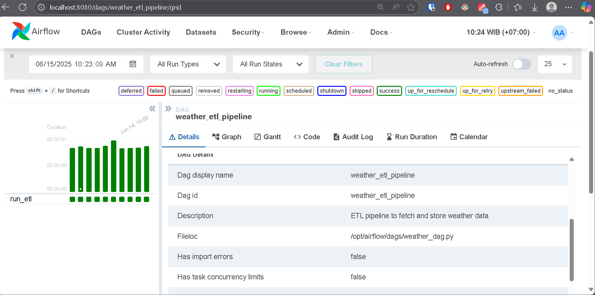
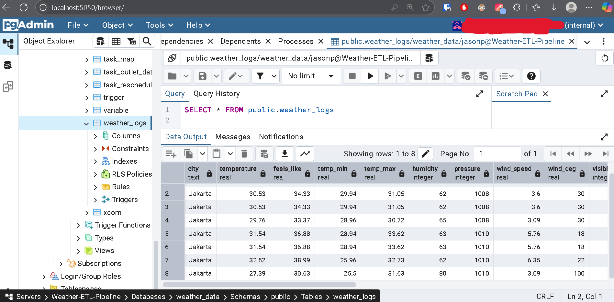

# Weather ETL Pipeline
🚀 This is a personal project I built by myself. This project pulls weather data from the **OpenWeatherMap API**, processes it using ETL (Extract, Transform, and Load), and stores it into a **PostgreSQL database**, which I access via **pgAdmin 4**. All of those processes are completely **automated** to run once every hour (As long as the server is running) via the use of **Apache Airflow** and run inside a **Docker** container.

\

🔄 **Automated Data Pipeline:**\
**1. ☁️ Weather API**\
OpenWeatherMap, as one of the largest provider of global weather data via API, is used as the source of weather data. It provides the necessary weather data like temperature, humidity, wind speed, and the description of the weather itself. It supports a wide variety of cities in the world, including Jakarta.\
**2. ETL**\
Since Apache Airflow is used to automate the ETL process, a **DAG (Directed Acyclic Graph)** is used. DAG basically functions as the recipe or procedure of doing all of the ETL processes. In this project, the DAG is the file "weather_dag.py."\
**2.1 📥 Extract (extract.py)**\
In this case, the city of Jakarta is used as the location of the weather data collection. The "metric" unit is also used for generalization. The process results in getting a raw weather data from the OpenWeatherMap API.\
**2.2 🔧 Transform (transform.py)**\
This step selects relevant weather data to store and makes the data structured and consistent by ordering the data. This process will result in getting a clean and concise data ready to be stored.\
**2.3 🗃️ Load (load.py)**\
In summary, this step takes the data from the previous step to my postgresql database inside a table named "weather_logs." If the table doesn't exist on the database, the table, with its required format to fits all the weather data, is created. Then the data is loaded into that table.\
**3. 🧠 Further Process and Analysis**\
All of the weather data which has been collected, processed, and stored in the postgresql database can further be analyzed for insights (e.g. Weather Trend Monitoring & Extreme Weather Anomaly Detection), used in machine learning models to forecast future weather conditions, or integrated with other systems like logistics and transport planning.

📁 Other File Explanations:\
**1. weather_dag.py**\
This DAG file basically makes all of the ETL processes run every hour automatically. It also has a feature to run the DAG 2 more times before marking it as failed.\
**2. .dockerignore**\
This file excludes any files when making container images in Docker.\
**3. docker-compose.yaml**\
This file contains the instructions to build the needed containers.\
**4. Dockerfile & requirements.txt**\
These two files contain the instructions to use the required Airflow environment, ensure Airflow can connect to the postgresql database, and ensure that the custom dependencies are used in the container.

🧰 Tech Stack:
| Part | Tools | Why I chose it |
| --- | --- | --- |
| **API** | OpenWeatherMap API | Free, related, widely used, and trusted |
| **Orchestration**  | Apache Airflow | Industry-standard for managing data pipelines |
| **Containerization** | Docker, Docker Compose, and Dockerfile | Ensuring consistent and reproducible environments to manage services |
| **ETL Scripts** | Python | Widely used for data science tasks |
| **Database** | PostgreSQL + pgAdmin 4 | Widely used and reliable database; pgAdmin 4 provides easier GUI access and query testing |
| **Versioning** | Git and GitHub | Tracking progress and making the project open source |
| **Code Editor** | VSCode | Widely used, easy-to-use, and feature-rich |
| **AI Assistant** | ChatGPT, Qwen, Deepseek, etc. | To help with faster writing, coding, debugging, and Fixes |

✅ Benefits for Society:
1. Reliable Weather Data Collection: Automates weather data collection using OpenWeatherMap API that is crucial for planning and operations.
2. Centralized Data Storage: Uses PostgreSQL database to store structured weather data in a centralized and containerized location to make it easier for other people to query, analyze, forecast, and build insights.
3. Improved Decision-Making: Enables weather-dependent industries like agriculture, logistics, and energy to analyze historical data and make data-driven decisions based on historical and real-time weather trends.
4. Human Error Reduction: With Apache Airflow managing the ETL process, the system runs with minimal human intervention, reducing the risk of errors.

💡 Things I Learnt:
1. Learning ETL and Data Pipelines: ETL and data pipelines are must-have skills when working in industries that depend on the flow of data.
2. Automation Skills: Learning Apache Airflow helps understanding how to automate the flow of data with minimal manual intervention.
3. Working with APIs: Using the OpenWeatherMap API helps me understand how to collect real-world data from web services.
4. PostgreSQL Practice: Using PostgreSQL help me understand how to use a widely-used database.
5. Containerization: Learning Docker helps me build portable and reproducible environments to ensure the performance of the system in any machine.

🛠️ Future Improvements:
1. I could have transformed the time-related data to use the local time (WIB) instead of UTC during the transform process. I certainly will prioritize this.
2. I could make data visualizations to visualize all the collected data. Things like weather trend and patterns can easily be spotted.
3. This project can include more cities and be more frequent to adapt to different industrial scenarios.

📬 Feedback or Contributions\
Feel free to contact me to discuss potential collaborations, provide feedback, report issues, or just say hello! I'm open to new ideas and opportunities. You can reach me via LinkedIn at https://www.linkedin.com/in/jason-pangestu-9a9a44248.

If you found this project helpful or interesting, don't forget to give it a star ⭐️ and share it with others who might benefit!

🚀 Thank you for your interest and support!